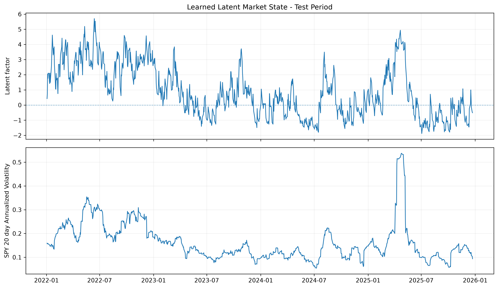

# Deep Latent Regime Discovery via Probabilistic Forecasting

A probabilistic deep-learning framework for investigating whether recurrent
sequence models can learn interpretable latent market structure from
multi-asset financial time series without explicit regime labels.

## Overview

Financial markets exhibit time-varying volatility, cross-asset dependence,
and persistent changes in market conditions that are often described as
regimes. Traditional regime-switching models typically impose discrete
latent states explicitly. This project instead asks whether economically
meaningful latent market structure can emerge naturally from a sequential
neural network model trained only to perform probabilistic forecasting.

A Gated Recurrent Unit (GRU) is used to model the temporal structure of the
market data. Unlike a model that treats each day's observations independently,
a GRU processes an ordered sequence and maintains a hidden state that summarizes
information from previous observations. This makes it suitable for financial
time series in which the current market state may depend not only on current
returns and volatility, but also on the path by which the market arrived there.
The GRU architecture also uses learned gating mechanisms to determine which
historical information should be retained or discarded as the sequence evolves.
More information about a GRU and it's mechanics can be found here: https://docs.pytorch.org/docs/2.14/generated/torch.nn.GRU.html

For each forecast, the GRU processes a 60-day history of multi-asset returns
and realized volatility. Its final hidden state is compressed into a
three-dimensional latent representation, which is then used to parameterize a
Gaussian predictive distribution for the five-day forward SPY log return.

Importantly, the model is never given regime labels, and no clustering objective
is imposed during training. The latent representation is learned solely through
the probabilistic forecasting objective and is analyzed only after training is
complete.

## Research Question

The core question that is being investigated is can a recurrent probabilistic
model learn a low dimensional interpretable representation of a market state without
supervision.

Key investigations include:

1. Whether a GRU can produce a useful probabilistic forecast of future equity returns.
2. Whether its learned latent representation exhibits low dimensional structure.
3. Whether that latent structure corresponds to observable financial characteristics such as return paths and volatility.
4. Whether the representation contains temporal information beyond the existing market state.

## Data

Daily adjusted market data was collected from 2005 through 2025 for five
prominent, and liquid, ETFs representing several major asset classes:

| Ticker | Market Exposure |
|--------|-----------------|
| SPY | U.S. large-cap equities |
| QQQ | U.S. technology/growth equities |
| IWM | U.S. small-cap equities |
| TLT | Long-duration U.S. Treasury bonds |
| GLD | Gold |

For each asset, two features were constructed namely:

- daily log return, due to the multiplicative stochastic nature
- 20-day annualized realized volatility, due to approximation of trading days per month

Hence, this created a ten-dimensional observation vector at each date.

Daily log returns are defined as

$$
r_t = \log\left(\frac{P_t}{P_{t-1}}\right).
$$

Twenty-day annualized realized volatility is estimated as

$$
\hat{\sigma}_{t,20} = \sqrt{252} \sqrt{ \frac{1}{19} \sum_{i=t-19}^{t}(r_i-\bar r_t)^2 }.
$$

The forecasting target is the cumulative five-day forward SPY log return:

$$
Y_t = \sum_{j=1}^{5} r^{SPY}_{t+j} = \log\left(\frac{P_{t+5}}{P_t}\right).
$$

### Temporal Splitting and Leakage Control

The dataset is split chronologically:

- **Training:** 2005-2018
- **Validation:** 2018-2021
- **Test:** 2022-2025

Forecast targets are retained only when a complete five-day target horizon lies
within the corresponding partition. Feature normalization is fit using training data only,
and subsequently applied to validation and test data.

Each model observation consists of a 60-day historical sequence. Historical input context
may precede the beginning of a partition because those observations would be available at
the forecast date. **Future information is never used to construct model inputs**.

## Model Architecture

The model is designed around a low-dimensional latent bottleneck. Rather than
mapping the 60-day market history directly to a point forecast, the GRU first
compresses the sequence into a hidden representation, which is then projected
into a three-dimensional latent state. The probabilistic forecast must be
constructed entirely from this latent representation.

The architecture can be summarized as

$$ 
X_{t-59:t} \;\longrightarrow\; h_t \;\longrightarrow\; z_t \;\longrightarrow\;(\mu_t,\sigma_t),
$$

where

$$
X_{t-59:t}\in\mathbb{R}^{60\times10}, \qquad h_t\in\mathbb{R}^{32}, \qquad z_t\in\mathbb{R}^{3}.
$$

Here, $X_{t-59:t}$ contains the 60-day sequence of standardized multi-asset
returns and realized-volatility features, $h_t$ is the final GRU hidden state,
and $z_t$ is the learned latent market representation.

### GRU Sequence Encoder

A GRU processes the input sequence recursively while maintaining a hidden state.
At each time step, an update gate determines how much information from the
previous hidden state should be retained, while a reset gate controls how much
past information contributes when constructing the candidate state.

For an input vector $x_t$ and previous hidden state $h_{t-1}$,

$$
r_t = \sigma(W_r x_t + U_r h_{t-1} + b_r),
$$

$$
u_t = \sigma(W_u x_t + U_u h_{t-1} + b_u),
$$

$$
\tilde{h}_t = \tanh\left(W_h x_t + U_h(r_t \odot h_{t-1}) + b_h \right),
$$

and

$$
h_t =(1-u_t)\odot\tilde{h}_t+ u_t\odot h_{t-1}.
$$

The gating mechanism allows the network to learn which historical information
should persist through the sequence rather than requiring a fixed set of
hand-designed temporal dependencies.

After processing all 60 observations, the final hidden state $h_t$ summarizes
the sequence available at the forecast date.

Traditionally $z_t$ is used for the update gate in GRU architectures, but for a notational convenience for the reader, $u_t$ is used
in order to prevent confusion with the three-dimensional latent representation variable.

### Latent Bottleneck

The 32-dimensional final hidden state is projected into a three-dimensional
latent representation:

$$
z_t = W_z h_t + b_z, \qquad z_t\in\mathbb{R}^{3}.
$$

No regime labels, clustering loss, or predefined economic states are used to
construct $z_t$. The latent representation is learned solely through the
forecasting objective.

A linear latent transformation is used without an additional bounded activation
function so that the model is not forced to compress the representation into a
predefined range.

### Probabilistic Output

Two output heads map the latent representation to the parameters of a Gaussian
predictive distribution:

$$
\mu_t = W_\mu z_t + b_\mu,
$$

$$
\sigma_t = \operatorname{softplus}(W_\sigma z_t+b_\sigma)+\epsilon,
$$

where the softplus transformation guarantees $\sigma_t>0$.

The resulting conditional forecast is

$$
Y_t \mid X_{t-59:t} \sim \mathcal{N}(\mu_t,\sigma_t^2),
$$

where $Y_t$ is the five-day forward cumulative SPY log return.

The model therefore predicts both the conditional location and uncertainty of
future returns rather than producing only a point estimate.

## Training Objective and Optimization

### Gaussian Negative Log-Likelihood

The model is trained by minimizing the Gaussian negative log-likelihood (NLL) of the observed five-day forward SPY returns under its predicted conditional distribution.

For each observation, the model produces a conditional mean $\mu_t$ and standard deviation $\sigma_t > 0$, defining

$$
Y_t \mid X_{t-59:t} \sim \mathcal{N}(\mu_t,\sigma_t^2).
$$

The Gaussian probability density is

$$
p(y_t \mid X_{t-59:t}) = \frac{1}{\sigma_t\sqrt{2\pi}} \exp\left(-\frac{(y_t-\mu_t)^2}{2\sigma_t^2} \right).
$$

Taking the negative logarithm gives the per-observation loss

$$
\mathcal{L}_t = \log\sigma_t + \frac{(y_t-\mu_t)^2}{2\sigma_t^2} + \frac{1}{2}\log(2\pi).
$$

The training objective minimizes the average NLL across observations:

$$
\mathcal{L}(\theta) = \frac{1}{N} \sum_{t=1}^{N} \mathcal{L}_t(\theta),
$$

where $\theta$ denotes the trainable parameters of the GRU encoder, latent projection, and probabilistic output heads.

Unlike mean squared error, which focuses exclusively on point-prediction accuracy, Gaussian NLL jointly optimizes the conditional mean and predictive uncertainty. Large forecast errors are penalized relative to the predicted variance, while unnecessarily large uncertainty estimates are penalized through the logarithmic term.

Consequently, the model must balance forecast accuracy against the uncertainty assigned to its predictions.

### Indirect Supervision of the Latent Representation

Although the model is not provided with regime labels, its latent representation is not entirely unsupervised.

Both Gaussian parameters are functions of the latent state:

$$
\mu_t = f_\mu(z_t), \qquad \sigma_t = f_\sigma(z_t).
$$

Therefore, the forecasting loss depends on the latent representation through

$$
\mathcal{L}_t = \mathcal{L}_t \left(f_\mu(z_t), f_\sigma(z_t), y_t \right).
$$

During backpropagation, gradients propagate through both output heads into the latent projection and GRU encoder:

$$
\frac{\partial \mathcal{L}_t}{\partial z_t} = \frac{\partial \mathcal{L}_t}{\partial \mu_t} \frac{\partial \mu_t}{\partial z_t} + \frac{\partial \mathcal{L}_t}{\partial \sigma_t} \frac{\partial \sigma_t}{\partial z_t}.
$$

For the Gaussian NLL,

$$
\frac{\partial \mathcal{L}_t}{\partial \mu_t} = \frac{\mu_t-y_t}{\sigma_t^2},
$$

while

$$
\frac{\partial \mathcal{L}_t}{\partial \sigma_t} = \frac{1}{\sigma_t} - \frac{(y_t-\mu_t)^2}{\sigma_t^3}.
$$

The first gradient pushes the predicted conditional mean toward the observed target. The second adjusts the predicted uncertainty according to the size of the forecast error.

Because both gradients propagate into $z_t$, the latent bottleneck is encouraged to encode information useful for both the conditional location and conditional uncertainty of future returns.

The latent state is therefore **indirectly supervised by the probabilistic forecasting objective**, rather than explicitly supervised to reproduce predefined economic regimes. Any interpretable latent market structure emerges as a consequence of learning to forecast conditional return distributions, not from an imposed regime-classification or clustering objective.

### Optimization

The model is trained using the following configuration:

| Hyperparameter | Value |
|---|---:|
| Optimizer | AdamW |
| Learning rate | $10^{-3}$ |
| Weight decay | $10^{-4}$ |
| Batch size | 64 |
| Maximum epochs | 50 |
| Gradient clipping | Maximum norm of 1.0 |
| Random seed | 42 |
| Model selection | Lowest validation NLL |

Gradient clipping is applied to limit excessively large gradient updates during recurrent network training. This allows for training to have reduced variance in exchange for increase in bias.

The model checkpoint with the lowest validation NLL is retained for out of sample evaluation. The test period is not used to select the model checkpoint or training epoch.

## Out of Sample Forecast Evaluation

After model selection using validation NLL, the best performing checkpoint is evaluated on the held-out 2022–2025 test period. The test set contains 998 forecasts and is not used during model training or checkpoint selection.

Because the model predicts an entire conditional distribution rather than only a point estimate, evaluation considers both conventional forecast errors and the quality of the predicted uncertainty.

### Predictive Performance

Out of sample performance on the test period is summarized below:

| Metric | Test Result |
|---|---:|
| Gaussian NLL | -2.3756 |
| MAE | 0.0195 |
| RMSE | 0.0256 |
| Mean realized return | 0.00217 |
| Mean predicted return | -0.00345 |

The mean forecast error,

$$
\mathbb{E}[Y_t-\mu_t],
$$

is approximately $0.00561$, indicating that the model's conditional mean forecasts were negatively biased over the test period: realized five-day SPY returns were, on average, higher than the model predicted.

However, the primary objective of the model is probabilistic rather than purely point based forecasting. The predicted scale parameter $\sigma_t$ provides an estimate of the model's conditional uncertainty for each forecast.

### Standardized Residuals

To evaluate whether the predicted conditional distributions appropriately describe the realized observations, standardized residuals are defined as

$$
e_t = \frac{Y_t-\mu_t}{\sigma_t}.
$$

Under a correctly specified Gaussian conditional distribution, these residuals should approximately follow

$$
e_t \sim \mathcal{N}(0,1).
$$

The test period standardized residuals have the following empirical moments:

| Statistic | Value |
|---|---:|
| Mean | 0.228 |
| Standard deviation | 0.911 |
| Skewness | -0.508 |
| Excess kurtosis | 0.263 |

The positive residual mean is consistent with the negative bias in the model's conditional mean forecasts. A standard deviation below one suggests that the predicted conditional distributions are slightly wider than necessary on average.

The residuals also retain moderate negative skewness, indicating some remaining asymmetry that cannot be represented by the symmetric Gaussian output distribution. Excess kurtosis, however, is relatively small.

The relatively small residual excess kurtosis suggests that severe heavy tailed behavior is not present in the standardized forecast errors over this test period. However, this statistic should not be compared directly with the kurtosis of daily SPY returns, since temporal aggregation of returns generally reduces excess kurtosis, making the two figures not directly comparable.

### Prediction Interval Calibration

A probabilistic forecasting model should produce prediction intervals whose empirical coverage is close to their nominal probability.

For a central prediction interval with nominal coverage $p$, the Gaussian forecast interval takes the form

$$
\left[\mu_t-z_p\sigma_t,\; \mu_t+z_p\sigma_t \right],
$$

where $z_p$ denotes the corresponding standard-normal critical value.

Empirical test-period coverage is:

| Nominal Coverage | Empirical Coverage |
|---|---:|
| 68% | 68.9% |
| 90% | 94.1% |
| 95% | 97.1% |

The central 68% interval is closely calibrated, while the 90% and 95% intervals exhibit modest over coverage. This is consistent with the standardized residual standard deviation of $0.911$, suggesting that the model's predicted distributions are somewhat conservative at wider interval levels.

Overall, the Gaussian GRU produces reasonably calibrated out of sample predictive distributions, with particularly close calibration over central prediction intervals and modest over-coverage at higher nominal levels. The residual location shift and negative skewness nevertheless indicate remaining distributional misspecification.

These results establish the forecasting behavior of the model before examining the learned latent representation. The next analysis investigates whether the forecasting objective caused the GRU to organize its three-dimensional latent bottleneck into an interpretable representation of market state.

## Latent Representation Analysis

After establishing the model's out of sample forecasting behavior, the learned
latent representations are analyzed to determine what information the GRU
encoded from the 60-day market histories.

Importantly, this analysis is performed after forecasting training is complete.
No clustering objective, regime labels, or economic state labels are used to
construct the latent representation.

### Effective Dimensionality of the Latent Space

Although the model is given a three-dimensional latent bottleneck,

$$
z_t \in \mathbb{R}^3,
$$

the three learned coordinates are highly correlated. To quantify the effective
dimensionality of the representation, Principal Component Analysis (PCA) is
applied to the latent states.

To avoid using the test period to determine the latent transformation, the
standardization parameters and PCA basis are fit using training period latent
states only. The fitted transformation is then applied unchanged to the
2022–2025 test-period representations.

The explained variance ratios obtained from the training latent states are:

| Principal Component | Explained Variance |
|---|---:|
| PC1 | 98.91% |
| PC2 | 1.05% |
| PC3 | 0.05% |

Thus, despite providing the model with a three-dimensional bottleneck, the
forecasting objective produced an effectively one-dimensional latent
representation.

This dimensional concentration is not necessarily a failure of the
architecture. The training objective does not require the three latent
coordinates to encode independent factors. Instead, it rewards any
representation that allows the model to construct useful conditional mean and
uncertainty forecasts.

For the remainder of the analysis, the first principal component is therefore
treated as the model's primary learned **latent market state factor**.

### Temporal Persistence

The latent factor evolves smoothly through time rather than behaving as
independent noise. The original latent coordinates exhibit strong
autocorrelation, including lag-20 correlations of approximately 0.62–0.64.

This persistence alone should not be interpreted as evidence of discrete market
regimes. Consecutive forecasts are constructed from heavily overlapping 60-day
input windows, and the realized volatility features are themselves persistent.
Both mechanisms naturally induce temporal dependence in the learned state.

The analysis therefore focuses on determining what observable market
information is associated with the latent factor rather than imposing discrete
regime boundaries.

### Relationship to Observable Market Conditions

The learned factor is strongly associated with equity market volatility. During
the test period, its contemporaneous correlations with realized volatility are:

| Feature | Correlation with PC1 |
|---|---:|
| QQQ 20-day volatility | 0.802 |
| SPY 20-day volatility | 0.779 |
| IWM 20-day volatility | 0.671 |
| TLT 20-day volatility | 0.615 |
| GLD 20-day volatility | 0.088 |

The factor therefore appears to be dominated by equity volatility, but it is
not simply an affine copy of a single volatility feature.

Recent equity performance also exhibits a substantial negative relationship
with the learned state:

| Feature | Correlation with PC1 |
|---|---:|
| QQQ 20-day cumulative return | -0.567 |
| SPY 20-day cumulative return | -0.564 |
| IWM 20-day cumulative return | -0.492 |
| SPY 5-day cumulative return | -0.423 |
| QQQ 5-day cumulative return | -0.418 |
| IWM 5-day cumulative return | -0.407 |

Under the orientation produced by the fitted PCA transformation, higher values
of PC1 therefore tend to correspond to elevated equity volatility and weaker
recent equity performance. The sign of a principal component is arbitrary, so
the economically relevant result is the relationship between the factor and
these market characteristics rather than the sign itself.

### Does the Latent Factor Contain Historical Information?

Because the GRU observes an entire 60-day sequence, existing correlations
alone cannot determine whether the latent factor contains information about the
recent market path.

To investigate this, Random Forest regressors are used as diagnostic models to
reconstruct PC1 from different sets of observable features. These models are
fit using the 2005–2018 training period and evaluated on the held out 2022–2025
test period.

The reconstruction results are:

| Reconstruction Features | Test $R^2$ |
|---|---:|
| Current market features | 0.7081 |
| Current + recent returns | 0.7720 |
| Current + volatility changes | 0.6889 |
| Current + all temporal summaries | 0.7707 |

Current market features alone reconstruct a substantial portion of the latent
factor, confirming that the representation is strongly related to observable
market conditions.

However, adding 5-day and 20-day cumulative return histories increases
out-of-sample reconstruction $R^2$ from 0.7081 to 0.7720. In contrast,
adding changes in realized volatility reduces out of sample reconstruction
performance to 0.6889, and combining all temporal summaries does not improve
upon the return history model.

These results suggest that the additional temporal structure represented by the
GRU is primarily associated with the recent path of equity returns rather than
changes in already-observed realized volatility.

The unexplained portion of PC1 should not be interpreted directly as "GRU
memory." It may reflect information from the full 60-day path, nonlinear
interactions, distributional changes, or limitations of the reconstruction
models.

### Learned Market State Through Time

The figure below compares the learned latent factor with SPY 20-day annualized
realized volatility during the held-out test period.



PC1 generally rises during periods of elevated realized volatility and declines
during calmer market conditions, while the two series are not identical. This
is consistent with the reconstruction experiments: existing volatility
explains a substantial component of the learned state, while recent equity
return history provides additional explanatory information.

### Interpretation

Taken together, the results indicate that the GRU learned an effectively
one-dimensional **continuous market state representation** dominated by equity
volatility, with additional dependence on the recent path of equity returns.

A useful empirical summary is

$$
z_t^{PC1} \approx f(\text{current equity volatility}, \text{recent equity return path}, \text{other market-state information}).
$$

The evidence does **not** establish the existence of discrete market regimes.
In particular, temporal persistence or visually distinct regions of the latent
trajectory would not by themselves justify imposing discrete state labels.

Instead, the results support a more conservative conclusion, which is: a recurrent
probabilistic forecasting model can compress multidimensional market histories
into a low-dimensional and economically interpretable continuous state without
being explicitly trained to identify regimes.

## Limitations and Future Work

The results provide evidence that a recurrent probabilistic forecasting model
can learn an interpretable low-dimensional representation of market state.
Several limitations, however, constrain the conclusions that can be drawn from
the experiment.

### Continuous State vs. Discrete Regimes

The original motivation for the project was to investigate whether latent market
regimes could emerge without explicit regime supervision. The learned
representation exhibits strong temporal persistence and economically meaningful
structure, but the analysis does not provide sufficient evidence that the market
state is naturally divided into discrete regimes.

In particular, clustering an effectively one-dimensional and persistent latent
trajectory could produce apparently distinct groups even when the underlying
representation varies continuously. For this reason, discrete clustering is not
used as evidence of regime discovery.

The primary result should therefore be interpreted as the discovery of a
continuous latent market state factor rather than a discrete regime
classification.

### Effective Dimensional Collapse

Although the architecture provides a three-dimensional latent bottleneck, PC1
explains 98.91% of the variance in the training-period latent representations.

This does not necessarily indicate optimization failure. The Gaussian NLL
objective only requires the latent representation to contain information useful
for constructing the conditional mean and scale parameters. Nothing in the loss
requires the three latent dimensions to encode independent economic factors.

Future work could investigate whether alternative objectives, larger forecasting
tasks, multi horizon targets, or explicit representation learning constraints
produce richer multidimensional latent structure.

### Forecasting Baseline

To contextualize the GRU's performance, it is compared against a constant
Gaussian benchmark whose mean and standard deviation are estimated solely from
the training-period targets.

| Metric | Constant Gaussian Baseline | GRU |
|---|---:|---:|
| Test NLL | -2.3104 | -2.3756 |
| Test MAE | 0.01785 | 0.0195 |
| Test RMSE | 0.02401 | 0.0256 |

The GRU achieves a lower (more negative) out-of-sample Gaussian NLL than the
constant benchmark, indicating a better-fit conditional predictive
distribution. The constant benchmark, however, achieves lower MAE and RMSE,
indicating that its point forecasts are closer to the realized returns on
average.

This pattern is consistent with the objective the GRU was trained on. Gaussian
NLL rewards an appropriately scaled conditional distribution, not solely an
accurate conditional mean. The benchmark's training mean (0.001496) and sigma
(0.023837) are close to unconditional over the training period, and this fixed
estimate of return and volatility is apparently competitive with, or better
than, the GRU's conditional mean on a pure point forecast basis during the test
window. The GRU's advantage therefore lies specifically in modeling the
conditional predictive distribution rather than improving the point forecast,
which is the more conservative and accurate framing of its usefulness.

The current benchmark is deliberately simple and unconditional. Future work
could compare the model against stronger conditional probabilistic benchmarks
such as rolling-volatility Gaussian models, GARCH, or other econometric
volatility forecasts, which would be a tougher and more informative bar than a
single fixed mean and sigma.

### Gaussian Distributional Assumption

The predictive distribution was assumed to be conditionally Gaussian:

$$
Y_t \mid X_{t-59:t} \sim \mathcal{N}(\mu_t,\sigma_t^2).
$$

Out of sample calibration is reasonably strong, but the standardized residuals
retain a positive location shift and moderate negative skewness. Because the
Gaussian distribution is symmetric, it cannot explicitly represent conditional
asymmetry.

More flexible predictive distributions could be investigated in future work.
However, the current model already exhibits modest over coverage at wider
prediction intervals, so simply introducing heavier symmetric tails would not
necessarily improve calibration.

### Overlapping Forecast Horizons

The five-day forecasting targets overlap across consecutive observations.
Consequently, neighboring forecast errors and targets are not statistically
independent.

This does not constitute look ahead leakage because every target is constructed
strictly from observations occurring after its corresponding forecast date.
However, the dependence should be considered when conducting formal statistical
inference or significance testing on forecast performance.

Future evaluation could additionally use non overlapping forecast origins or more
dependence aware statistical tests.

### Interpretation of Temporal Reconstruction

Adding recent cumulative equity returns improves out of sample reconstruction of
the latent factor from $R^2=0.7081$ to $R^2=0.7720$. This provides evidence
that recent return path information is associated with the learned
representation beyond contemporaneous market features.

The remaining unexplained variation should not, however, be interpreted directly
as recurrent network memory. It may reflect nonlinear interactions, information
contained elsewhere in the full 60-day sequence, distribution shift, or
limitations of the reconstruction model.

### Scope of the Market Universe

The model is trained on five liquid ETFs representing U.S. equities,
long-duration Treasury bonds, and gold. The learned representation is therefore
specific to this feature universe, forecasting target, sample period, and model
objective.

Future work could examine whether similar latent structure emerges across a
broader cross asset universe, different forecast horizons, alternative market
periods, or different forecasting targets.

---

## Conclusion

This project investigated whether a recurrent neural network trained for
probabilistic forecasting could learn interpretable latent market structure
without being provided explicit regime labels.

Relative to a constant Gaussian benchmark estimated from the training period,
the GRU improves out of sample Gaussian NLL from -2.3104 to -2.3756. The
constant benchmark nevertheless achieves lower MAE and RMSE, indicating that
the GRU's forecasting advantage lies in modeling the conditional predictive
distribution rather than improving point prediction. This distinction is
consistent with the project's emphasis on probabilistic forecasting and
latent market state representation.

A GRU processed 60-day sequences of returns and realized volatility from five
major ETFs and compressed each sequence into a three-dimensional latent
representation. This representation parameterized a Gaussian distribution for
the five-day forward SPY return and was trained end to end using negative
log likelihood.

On the held out 2022–2025 test period, the model produced reasonably calibrated
predictive distributions. The empirical coverage of nominal 68%, 90%, and 95%
prediction intervals was 68.9%, 94.1%, and 97.1%, respectively, although
standardized residual diagnostics revealed remaining mean bias and negative
skewness.

Analysis of the learned representation produced the central result of the
project. Despite being given a three-dimensional bottleneck, the model organized
its latent space into an effectively one-dimensional structure, with the first
principal component explaining 98.91% of training period latent variance.

This factor is strongly associated with equity market volatility: its
test-period correlations with QQQ and SPY 20-day realized volatility are 0.802
and 0.779, respectively. It also contains information associated with recent
equity performance. Adding recent cumulative returns to existing market
features increases out of sample reconstruction $R^2$ from 0.7081 to 0.7720,
while adding volatility change features provides no corresponding improvement.

The resulting representation is therefore best interpreted not as a collection
of discrete market regimes, but as a continuous latent market state factor
dominated by equity volatility and augmented by information about the recent
equity return path.

More broadly, the experiment demonstrates that interpretable market state
structure can emerge as a byproduct of a probabilistic forecasting objective.
The model was never asked to classify market regimes. It was asked only to
compress historical information useful for predicting the conditional
distribution of future returns. The structure that emerged from that constraint
provides the principal empirical finding of the project.

## Repository Structure

```text
Deep-Latent-Regime-Discovery-Probabilistic-Forecasting/
├── data/
│   ├── raw/                         # Raw market data
│   └── processed/                   # Processed model features
│
├── figures/
│   └── latent_factor_vs_spy_vol.png
│
├── checkpoints/
│   └── best_gru_model.pt            # Best validation-NLL checkpoint
│
├── src/
│   ├── models/
│   │   ├── __init__.py
│   │   └── gru_forecaster.py        # GRU + latent bottleneck + Gaussian heads
│   │
│   ├── download_data.py             # Download raw ETF market data
│   ├── data_processing.py           # Return and realized-volatility features
│   ├── dataset.py                   # Targets, temporal splits, scaling, sequences
│   ├── torch_dataset.py             # PyTorch Dataset implementation
│   ├── losses.py                    # Gaussian negative log-likelihood
│   ├── train.py                     # Model training and checkpoint selection
│   ├── evaluate.py                  # Out-of-sample forecast evaluation
│   └── latent_analysis.py           # PCA and latent-state analysis
│
├── LICENSE
└── README.md
```

## Running the Project

The project is implemented in Python using PyTorch for deep learning and
scikit-learn for preprocessing and latent-state analysis.

### 1. Install Dependencies

The main dependencies are:

```text
numpy
pandas
matplotlib
scikit-learn
torch
yfinance
```

These can be installed with:

```bash
pip install numpy pandas matplotlib scikit-learn torch yfinance
```

### 2. Download Market Data

Raw daily market data for SPY, QQQ, IWM, TLT, and GLD can be downloaded by
running:

```bash
python src/download_data.py
```

The resulting files are stored in:

```text
data/raw/
```

### 3. Construct the Dataset

The processing pipeline constructs daily log returns, 20-day annualized realized
volatility, five-day forward SPY return targets, chronological data partitions,
and 60-day model sequences.

```bash
python src/dataset.py
```

Feature normalization is fit using training data only to prevent information
from the validation or test periods from entering the preprocessing pipeline.

### 4. Train the GRU

Train the probabilistic GRU with:

```bash
python src/train.py
```

Training minimizes Gaussian negative log-likelihood using the training period
and selects the model checkpoint with the lowest validation NLL.

The selected model is stored at:

```text
checkpoints/best_gru_model.pt
```

### 5. Evaluate Out-of-Sample Forecasts

Forecast performance on the held-out test period can be evaluated with:

```bash
python src/evaluate.py
```

The evaluation includes:

- Gaussian negative log-likelihood
- MAE and RMSE
- standardized residual diagnostics
- prediction-interval coverage
- calibration analysis

### 6. Analyze the Learned Latent Representation

The latent-state analysis can be reproduced with:

```bash
python src/latent_analysis.py
```

This analysis:

- extracts latent representations from the trained GRU
- fits PCA using training-period latent states
- transforms the held-out test-period states
- measures latent-state persistence
- compares the learned factor with observable market variables
- reconstructs the latent factor from contemporaneous and temporal features
- performs temporal-feature ablation experiments

The resulting out-of-sample latent-state visualization is stored in:

```text
figures/latent_factor_vs_spy_vol.png
```

## Reproducibility

The model uses a fixed random seed of `42`. Model selection is performed using
validation negative log-likelihood, while the 2022–2025 test period remains
held out from training and checkpoint selection.

The primary experimental pipeline is therefore:

$$
\text{Raw Market Data}
\rightarrow
\text{Feature Engineering}
\rightarrow
\text{Temporal Split}
\rightarrow
\text{60-Day Sequences}
\rightarrow
\text{GRU}
\rightarrow
z_t
\rightarrow
(\mu_t,\sigma_t)
\rightarrow
\text{Forecast Evaluation}
\rightarrow
\text{Latent Analysis}.
$$

## Technologies

- **Python**
- **PyTorch**
- **NumPy**
- **Pandas**
- **scikit-learn**
- **Matplotlib**
- **yfinance**